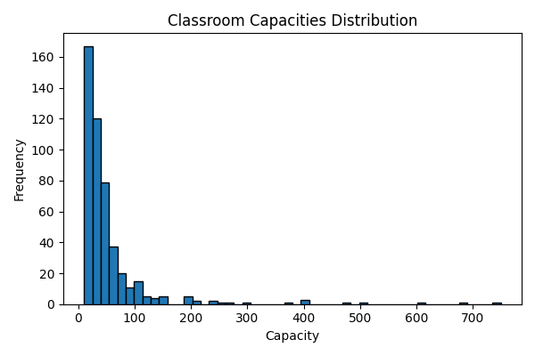
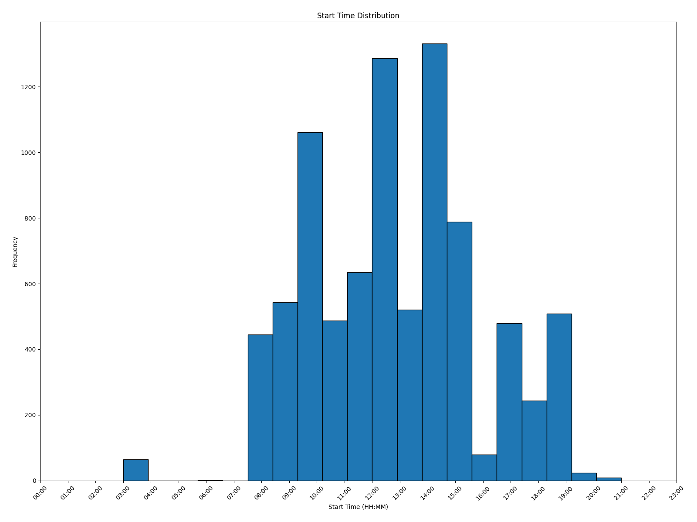
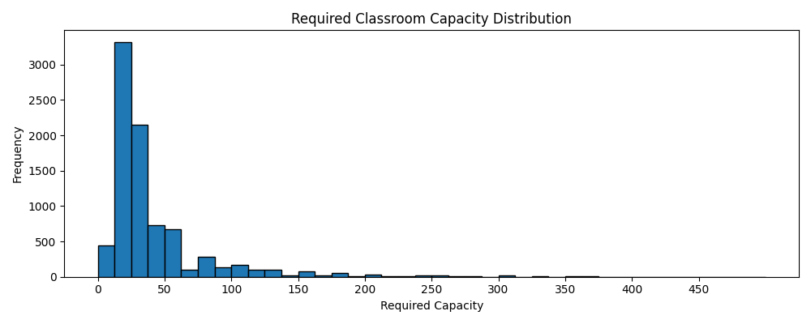
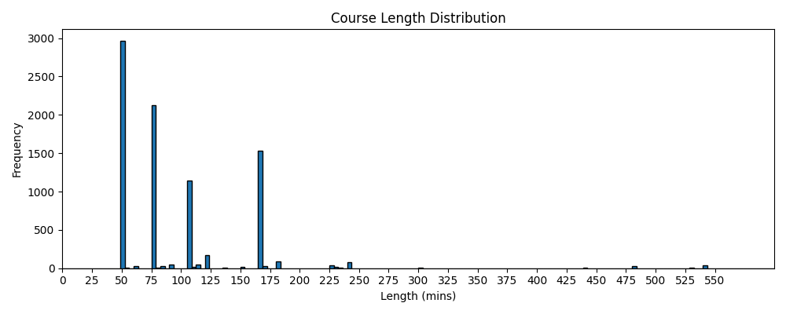
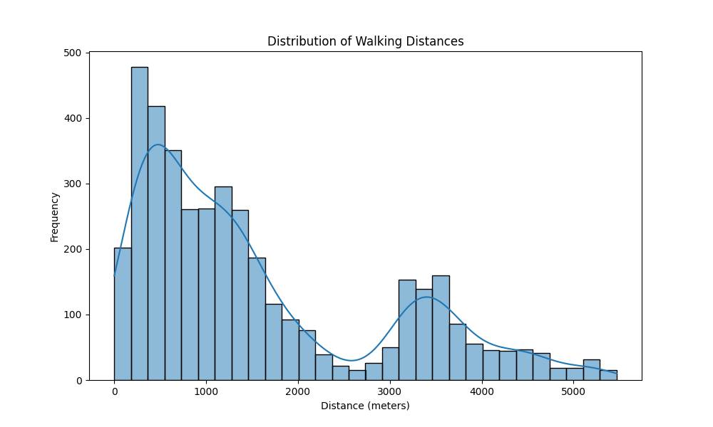
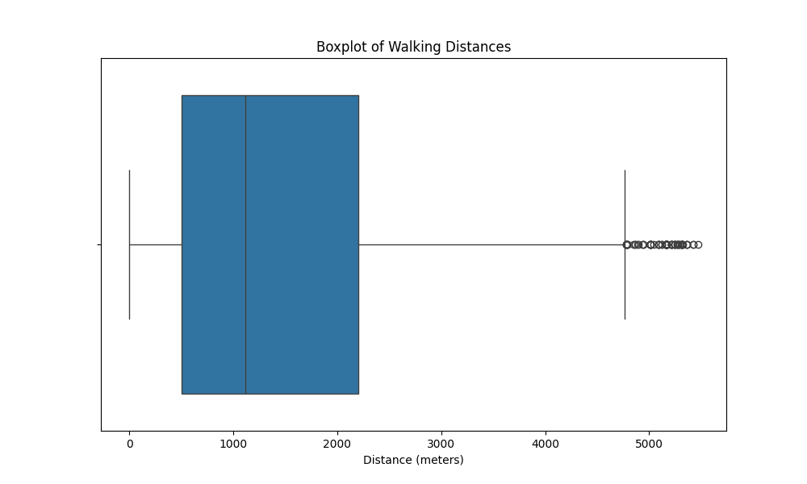
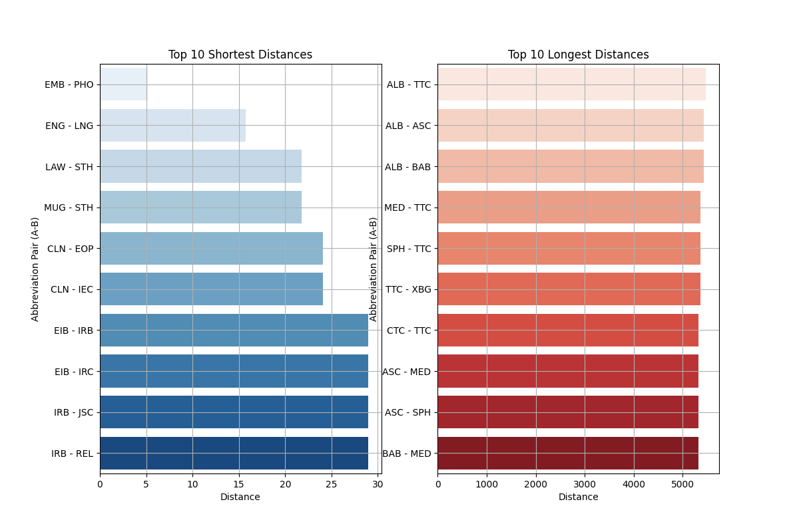
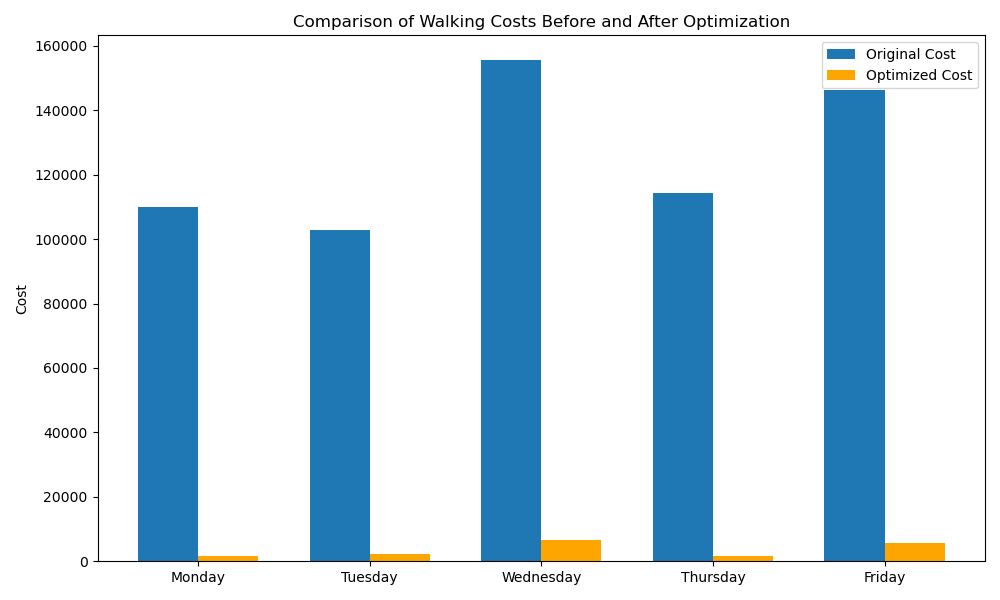
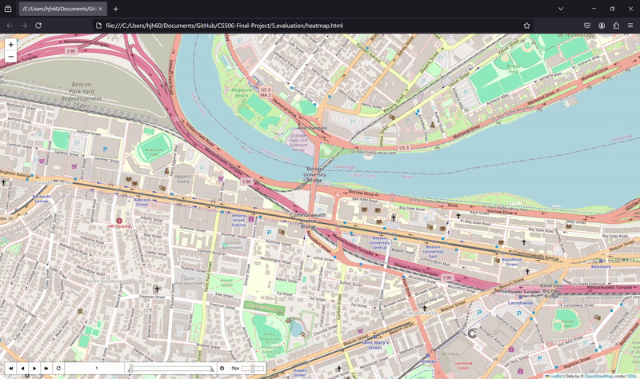

Visit the [HTML version](https://zilongpa.github.io/CS506-Final-Project/), which includes functional interactive maps.

# CS506 Final Project


> This is a 3D visualization of the campus created using Blender. Unfortunately, I was unable to complete it due to time constraints.

#### Project Title

Optimizing Classroom Allocation to Minimize Professors’ Walking Cost at Boston University

#### Group members

- Junhui Huang (hjh604@bu.edu)
- Mingyuan Sun (mingyuan@bu.edu)

#### Midterm Report
[Video](https://www.youtube.com/watch?v=cfRX62oWjNg)

#### Description

The project aims to optimize the allocation of classrooms to professors by considering each professor’s required classroom size at specific time periods and the cost associated with walking between classrooms. The objective is to reassign classrooms to minimize the total walking cost for all professors. The optimization will be performed using the simulated annealing in Python.

#### How to Run

1. **Install dependencies**:

```sh
make install
```

2. **Fetch data, preprocess, and run simulated annealing**

```sh
make run
```


## Goals

- Develop a classroom allocation model that minimizes the total walking cost for all professors.
- Take room capacity limits into account, and, if possible, consider additional factors such as media device requirements.
- Implement the model using the simulated annealing.
- Demonstrate the effectiveness of the model through comparative analysis with current planning at Boston University.


# Data Processing Report

### Overview

This report provides a detailed description of the data processing steps completed so far in our project. The data has been gathered from two primary sources: BU’s public student information system and BU’s classroom resources website. The main focus of this processing phase was to clean, reformat, and integrate data from these disparate sources to facilitate modeling and analysis.

### Data Collection

1. **Course Information**  
   - **Collected by**: Junhui Huang  
   - **Source**: [BU Public Student Information System](https://public.mybustudent.bu.edu/psp/BUPRD/EMPLOYEE/SA/s/WEBLIB_HCX_CM.H_CLASS_SEARCH.FieldFormula.IScript_Main)  
   - **Description**: All available course information for the Spring semester was scraped, covering details such as course names, schedules, locations, and instructor IDs.

2. **Classroom Information**  
   - **Collected by**: Mingyuan Sun  
   - **Source**: [BU Classroom Resource Finder](https://www.bu.edu/classrooms/find-a-classroom/)  
   - **Description**: Classroom details including room capacities, locations, and equipment were gathered from BU’s classroom finder website.

3. **Building Coordinates and Distance Matrix**  
   - **Collected by**: Junhui Huang  
   - **Description**: Geographical coordinates of all academic buildings were collected, and a matrix representing distances between each building was generated to calculate walking times between classrooms.

### Data Cleaning and Integration

- **Data Cleaning**
  - **Responsibility**: Mingyuan Sun
  - **Process**:  
    1. **Course and Classroom Data Cleaning**:  
       - **Irrelevant fields** are removed based on predefined keys.  
       - **Low-quality entries** (e.g., missing instructors, invalid meeting times, “Online” instruction mode, capacity values like 999 or 9999, “TBA” meeting patterns, or invalid classroom names containing ‘/’) are filtered out.  
       - **Unwanted instructor names** (e.g., “To Be Announced”) and classrooms with specific tags (e.g., “Medical Campus” or “Fenway Campus”) are discarded.  
       - **Rooms with invalid building codes** or “NO ROOM” entries are removed.  
       - Classroom names are normalized by replacing ‘-’ with ‘ ’ and removing text in parentheses.
    2. **Professor Schedule Cleaning**:  
       - Schedules are merged based on matching start and end times, combining counts for identical time slots to simplify and standardize schedule data.
  - **Reformatting**: Once cleaned, the data from various sources (courses, classrooms, schedules) is reformatted to maintain a consistent schema, ensuring compatibility and integration across different datasets.

- **Data Transformation**  
  - Fields were transformed and mapped across datasets, establishing links between course schedules and classroom details to support advanced scheduling models.

### Data Extraction for Modeling

From the cleaned and integrated dataset, the following data elements were extracted for use in modeling:

1. **Classroom Capacities**  
   - **Format**: Integer array  
   - **Description**: An array listing the seating capacity of each classroom, useful for determining space constraints in scheduling.
   - **Visualizations**
     - Below is a histogram illustrating the distribution of classroom capacities:
     - 
   
2. **Professor Schedule**  
   - **Format**: Dictionary with keys as `professor_id` and values as tuples `(start_time, end_time, capacity_required)`  
   - **Description**: Each professor’s weekly schedule, recorded in five-minute intervals, with a total of 2016 time slots per week. This structure also records each professor’s required classroom capacity.
   - **Visualizations**
     - 
     - 
     - 

3. **Walking Cost**  
   
   - **Format**: 2D Float Array `[i][j]`  

   - **Description**: A matrix representing the walking distance (cost) between classrooms `i` and `j`, facilitating calculations for optimal scheduling based on proximity.
   
   - **Visualizations**
   
     - 
   
     - Most of the buildings are reachable within 2200 meters, with an average distance of 1200 meters. The outliers on the right represent building pairs that require walking between the main campus and the medical campus. To maintain relevance to computer science activities, we will exclude medical campus buildings to avoid scenarios like scheduling a computer science class in an operating room.
   
     - 
   
     - We also provide a heat map of walking distances, which requires zooming in to view the values within the cells.
   
     - 
   
     - We also provide a [map displaying the distribution of building locations](1.acquisition-junhui_huang/map.html), along with another [map illustrating the paths from all other buildings to the LAW building](1.acquisition-junhui_huang/path_to_law_map.html). Below are the corresponding screenshots:
   
     - 
   
       


### Data Packaging

To streamline future data access, all processed datasets were serialized using Python’s `pickle` library. This approach allows for quick loading and ensures data consistency across multiple sessions and models.


## Modeling

Originally, the classroom assignment challenge was formulated as a linear optimization model. The objective was to allocate classrooms to professors in a way that **minimizes the total walking cost** across the entire schedule.

For the midterm, the optimization problem was modeled using PuLP and solved with the CBC solver on a small dataset. However, when we attempted to input the full schedule into the solver, the memory overflowed. To address this, we realized that schedules for different days are independent, allowing us to break down the problem into five smaller optimization tasks to reduce memory usage. Unfortunately, this approach still failed to run on a machine with 64GB of RAM.

Later, I decided to use **simulated annealing**, an optimization method often used for scheduling problems. The concept behind simulated annealing is to iteratively explore the solution space by allowing worse solutions to be accepted with a certain probability, gradually reducing this probability over time. This process helps avoid local minima and increases the likelihood of finding a near-optimal solution

My primary responsibility (Junhui Huang) was to design the cost function, and fortunately, our previous schema still worked in this context. The following constraints were incorporated into the optimization problem. Violating any of these constraints would result in a penalty of `1e6` added to the total cost, ensuring that the final solution is unlikely to breach them.


**Constraints**:

- **One Classroom per Course**: Each professor can only be assigned to one classroom at a time.
- **One Course per Classroom**: To prevent classroom conflicts, each classroom can host only one course at any given time. 
- **Classroom Capacity Constraint**: The capacity of each classroom must meet or exceed the demand of the assigned course. 


Another factor we considered was the cost of moving between classrooms within a building. Initially, we planned to develop an estimation algorithm to calculate the equivalent walking distance. However, we later realized that some buildings have elevators while others do not, making it difficult to develop a standardized approach. As a compromise, we decided to reward the algorithm with a reduction of `10` units from the total cost if it assigned a professor to the same classroom for two consecutive lectures. This incentivized the algorithm to maintain professors in the same room whenever possible.

Since simulated annealing does not guarantee an exact optimal solution, we decided to run the algorithm on each day's schedule for 11 hours. This approach was necessary because Kaggle imposes a two-hour execution limit, and downloading the dataset also takes time. To ensure robustness, the algorithm updates the pickle file `f'4.solutions/best_solution_{dayofweek}.pkl'` every time a more optimized solution is found. This guarantees that even if the program crashes, the best possible result up to that point is preserved.


### Hyperparameter tuning

Since the algorithm is implemented by myself using numpy and does not have a pre-built sklearn model API, I used nested loops to carry out the fine-tuning. Below is the code used for the hyperparameter tuning process:

```python
best_cost = float('inf')
best_solution = None
best_hyperparameters = None

temperatures = [500, 1000, 1500]
cooling_rates = [0.90, 0.95, 0.99]

for temp in temperatures:
    for rate in cooling_rates:
        print(f"Running with temperature={temp}, cooling_rate={rate}")
        solution, cost = simulated_annealing(
            professor_courses, 
            num_classrooms, 
            classroom_capacities, 
            walking_cost, 
            max_runtime, 
            temperature=temp, 
            cooling_rate=rate
        )

        if cost < best_cost:
            best_cost = cost
            best_solution = solution
            best_hyperparameters = (temp, rate)
```

After performing hyperparameter tuning on Monday's schedule, the optimal parameters were found to be `temperature=1000.0` and `cooling_rate=0.99`.


## Results

| **Day**   | **Original Walking Cost** | **Optimized Walking Cost** |
| --------- | ------------------------- | -------------------------- |
| Monday    | 109,916.716               | 1,735.569                  |
| Tuesday   | 102,759.072               | 2,208.329                  |
| Wednesday | 155,470.092               | 6,589.606                  |
| Thursday  | 114,212.881               | 1,715.063                  |
| Friday    | 146,141.078               | 5,805.840                  |

**Overall Improvement:** 97.12%

Below is a bar chart visualization, highlighting the comparison between the original and optimized walking costs:



We also have an animated heat map illustrating the occupancy of buildings, with an interactive version available [here](5.evaluation/heatmap.html).



### Conclusion and Future Directions

The results demonstrate that the algorithm significantly reduces the walking cost, showcasing its potential to provide practical arrangements for classroom allocation. However, the drastic improvement also reveals some limitations in the algorithm that could be addressed in future research. 

#### Future Directions
1. **Incorporating Additional Constraints:** 

   Certain disciplines at BU may have preferences for specific buildings, such as labs or discussion classes. Further analysis in this area could enhance the algorithm's realism.  

2. **Field Measurement of Inter-Building Distances:** 

   The current fixed value for intra-building changes does not fully capture the complexity of real-world scenarios. Differences between classrooms, as well as the cost of moving between floors, could be incorporated into the dataset for more accurate results.  

